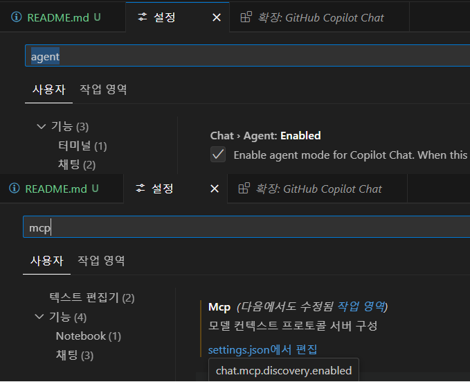
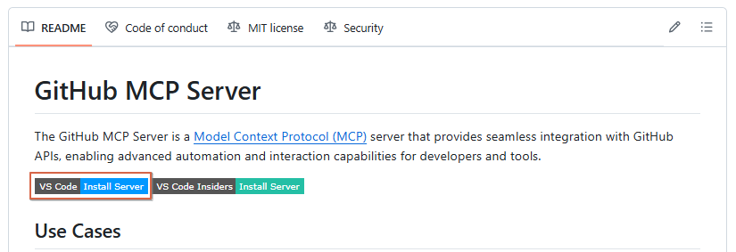
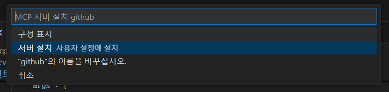
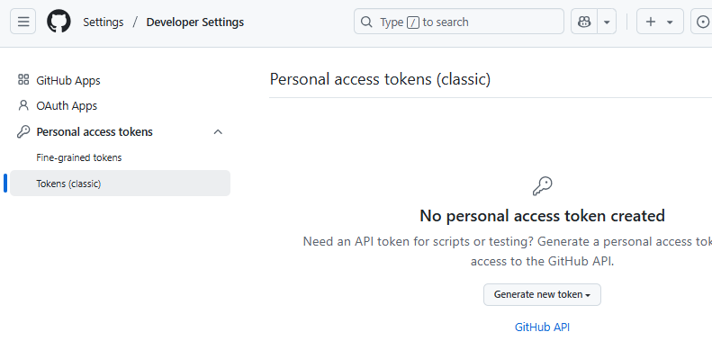
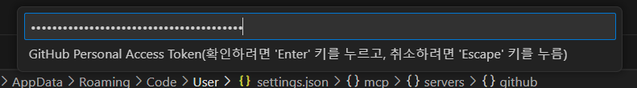

## MCP Server

### Model Context Protocol
- AI 어시스턴트와 외부의 데이터, 도구를 연결해서 다양한 소스를 연결하는 '개방형 표준' 프로토콜
- MCP의 예:
    - 슬랙 MCP와 구글 MCP를 VS Code에 연동해서 아래와 같은 시나리오 가능
    - "내일 있을 회의 일정을 확인해서 내 캘린더 일정에 추가해 줘"
- https://github.com/modelcontextprotocol 확인
- https://github.com/modelcontextprotocol/servers 진입

### 에이전트 모드
- Github Copilot / Github Copilot Chat 설치 후 설정
- 설정 메뉴

    

- MCP settings.json

    ```json
    "mcp": {
        "servers": {
            "mcp-server-time": {
                "command": "python",
                "args": [
                    "-m",
                    "mcp_server_time",
                    "--local-timezone=Asia/Seoul"
                ],
                "env": {}
            },
            "my-mcp-server-55ccabb8": {
                "type": "sse",
                "url": "http://localhost:3000"
            },
            // 아래는 나중에 추가됨
            "github": {
                "command": "docker",
                "args": [
                    "run",
                    "-i",
                    "--rm",
                    "-e",
                    "GITHUB_PERSONAL_ACCESS_TOKEN",
                    "ghcr.io/github/github-mcp-server"
                ],
                "env": {
                    "GITHUB_PERSONAL_ACCESS_TOKEN": "${input:github_token}"
                }
            }
        },
        "inputs": [
            {
                "id": "github_token",
                "type": "promptString",
                "description": "GitHub Personal Access Token",
                "password": true
            },
        ]
        }
    }
    ```

- MCP 연결
    - github mcp server 검색
    - https://github.com/github/github-mcp-server 의 Install Server 클릭

    

    

- GITHUB_PERSONAL_ACCESS_TOKEN 확인
    - Generate new token (classic) 클릭

    

    - 설정 후 Generate Token 버튼 클릭

- setting.json을 저장하면 프롬프트 팝업 
    - github access token 입력 후 엔터

    

- servers > github > command 에 docker가 적힌 것 처럼 도커 필요

- VS Code 재시작

### 장점
- 외부 도구와의 통합 강화: MCP를 통해 파일 시스템, 데이터베이스, 웹 서비스 등 다양한 외부 도구와의 상호작용이 표준화되어 개발 워크플로우가 간소화
- 에이전트 모드의 기능 확장: GitHub Copilot의 에이전트 모드와 MCP의 결합으로, 다단계 코딩 작업을 자동화하고, 오류를 감지하여 수정하는 등의 작업을 수행
- 유연한 서버 구성: MCP 서버는 로컬 또는 원격에서 실행될 수 있으며, 이를 통해 개발 환경에 맞는 유연한 구성이 가능

### VSCode와 MCP 연동
1. MCP 서버 추가
    - 명령 팔레트에서 MCP: Add Server 실행
2. 설정위치